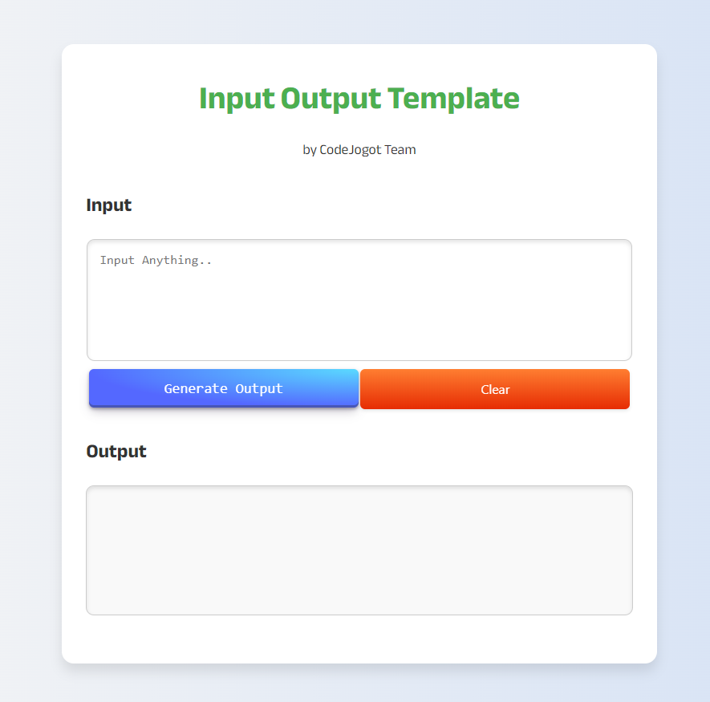

# Input Output Template for Problem Solving

- Problem Solving করতে গেলে অনেক সময়ই আমাদের Console এ Input নেয়া একটু বিরক্তিকর হয়। সেই কারনে একটা User-friendly Input Output Template বানানো হয়েছে। আশা করি, এটা অনেকের জন্য Helpful হবে। 
- এই Repo তে JS এর যে কোড আছে সেখানে  `mainFunction()` নামে একটা Function আছে, মুলত এই Function এই আমাদের কোডের Logic টা লিখতে হবে। প্রয়োজন হলে এই মেইন Function হতে আমরা আরও Function কেও Call করতে পারি, অনেকটা C++ এর Feel দিবে! C++ এ আমরা যেমন Main Function থেকে অন্য Function কে প্রয়োজন অনুসারে কল করে থাকি!

